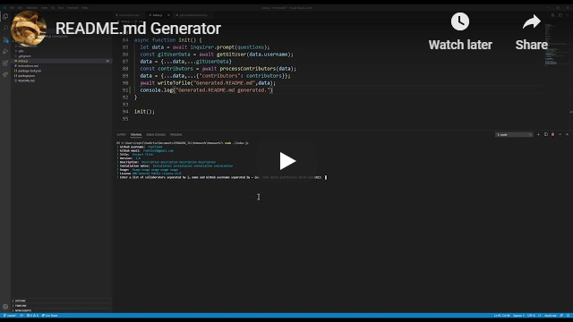

# Good README.md Generator  

[](https://youtu.be/tK_eEkkiu1E)

Node.js application that generates a README.md based on user input.

#### Table of Contents

1. [Installation](#installation)
2. [Usage](#usage)
3. [License](#license)
4. [Contributing](#contributing)
5. [Tests](#tests)
6. [Questions](#questions)

## Installation

After cloning the repository, type:
```
npm install
```

## Usage

To run, type:
```
node ./index.js
```

Next, simply follow the prompts.

For more information, watch the walkthrough video.

## License 

GNU General Public License v3.0

## Contributing

* [Johnny Li](https://github.com/reptile18)  


## Tests

Follow the steps provided in the walkthrough video.

## Questions

  
[](mailto:reptile18@gmail.com)

